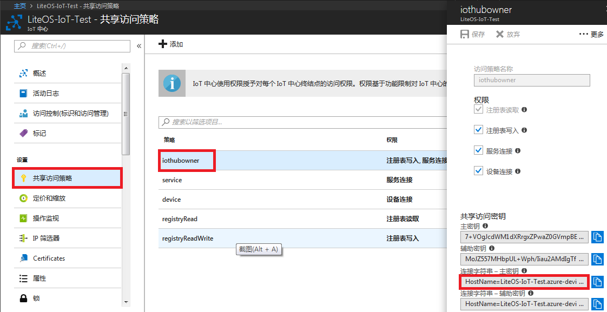
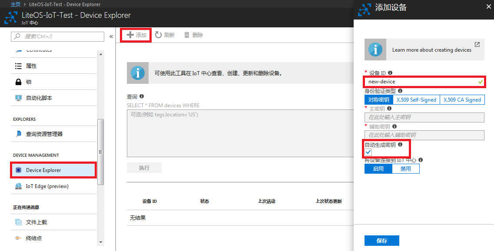
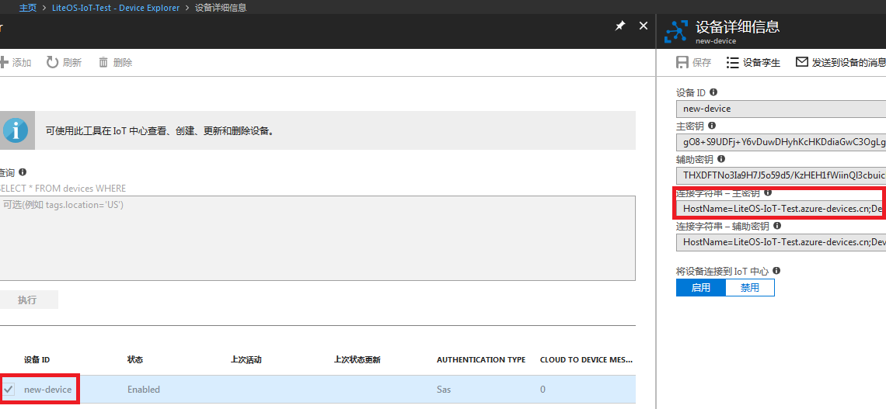
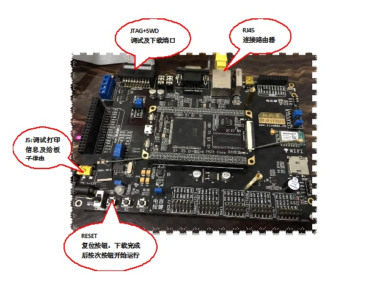

## 一、背景和介绍
### 1、公司/团队介绍

张新灵，嵌入式软件工程师，做过的产品有 指纹门禁/手机/可穿戴设备/360度辅助驾驶系统/OBDII诊断仪/电动汽车充电桩等

### 2、项目介绍

LiteOS对接微软Azure IoT中心

## 二、项目内容

### 1. 方案说明

（1）功能说明

对接Azure IoT中心，实现消息发布和订阅

（2）接入说明

通过板载以太网接入网络和Azure IoT以MQTT实现通信

（3）Azure IoT简单介绍

azure物联网提供有 IoT套件/IoT中心/事件中心/流分析/通知中心，可对接的协议有 mqtt/amqp/https等

### 2. 硬件方案

- 利用野火开发板和Azure Iot通信

### 3. 软件方案
- LiteOS核心
- 开发板驱动
- STM32F4 HAL 库
- LWIP协议栈
- azure-iot-sdk-c

  - `c-utility` c常用库
  - `iothub_client` 应用层接口
  - `umqtt` MQTT协议
  - `parson` JSON解析
  - `certs` 证书

- wolfssl

## 三、接入第三方云平台

### Azure Portal注册
- [国际节点](https://azure.microsoft.com/zh-cn/)
- [国内节点](https://www.azure.cn/zh-cn/)
- [注册 1 元试用订阅](https://docs.azure.cn/zh-cn/billing/billing-sign-up-azure-account-with-1rmb-trial-subscription)

**几个坑**
1. 注册完成后会扣1单位当地货币，主要选择国内站点注册
2. 微软账户和门户是不同的账户。一定要分清楚了！！！注册完成后的id类似cietest.partner.onmschina.cn，一定要记住了！！！！！！！！！！！！！！！！！
3. 如果遇到点击无反应，清理cookie和缓存再试试

### 创建 Aure IoT中心

创建 IoT 中心以后，即可找到将设备和应用程序连接到 IoT 中心时需要使用的重要信息。
1. 创建 IoT 中心后，请在仪表板中单击它。 记下“主机名”，并单击“共享访问策略”。

2. 在“共享访问策略”窗格中单击“iothubowner”策略，并复制并记下 IoT 中心的连接字符串。 有关详细信息，请参阅[控制对 IoT 中心的访问](https://docs.azure.cn/zh-cn/iot-hub/iot-hub-devguide-security)。


- 在 IoT 中心为设备进行设备注册

1. 在 [Azure 门户](https://portal.azure.cn/)中打开 IoT 中心。
2. 单击“设备资源管理器”。
3. 在“设备资源管理器”窗格中，单击“添加”将设备添加到 IoT 中心。 然后执行以下操作：

    **设备 ID**：输入新设备的 ID。 设备 ID 区分大小写。
    **身份验证类型**：选择“对称密钥”。
    **自动生成密钥**：选中此复选框。
    **将设备连接到 IoT 中心**：单击“启用”。

4. 单击“保存” 。
5. 创建设备后，在“设备资源管理器”窗格中打开设备。
6. 记下连接字符串的主密钥。


### [使用DevicExplorer进行模拟, 点我](https://github.com/Azure/azure-iot-sdk-csharp/tree/master/tools/DeviceExplorer)

在 ubuntu 上可编译 sdk 进行设备模拟，收发消息。

设置开发环境
```
sudo apt-get update
sudo apt-get install -y git cmake build-essential curl libcurl4-openssl-dev libssl-dev uuid-dev
```
检查cmake版本不小于2.8.12
```
cmake --version
```
检查gcc版本不小于4.4.7
```
gcc --version
```
编译sdk
```
cd azure-iot-sdk-c
mkdir cmake
cd cmake
cmake ..
cmake --build .  # append '-- -j <n>' to run <n> jobs in parallel
```
设置字符串
```
static const char* connectionString = "[device connection string]";
```
编译例子代码
```
cd ./azure-iot-sdk-c/cmake/serializer/samples
make
./simplesample_mqtt/simplesample_mqtt
```

观察DevicExplorer及由DevicExplorer下发命令

下发命令格式`simplesample_amqp`
```
{"Name":"SetAirResistance","Parameters":{"Position":55}}
{"Name":"TurnFanOn","Parameters":{}}
```

gif动画演示在本文档同级目录meta/azure-virtual-equipment-device-explorer-demo.gif

## 四、关键源代码解析

### 1. wolfssl移植: 一开始的时候，编译很多的错误，主要配置在 user_settings.h

- 获取代码
  - `git clone https://github.com/wolfSSL/wolfssl.git`
- internal.c

  - `LowResTimer()`

- memory.c
  - `malloc()` -> `platform_malloc()`
  - `realloc()` -> `platform_realloc()`
  - `free()` -> `platform_free()`
- random.c
  - `wc_GenerateSeed()`中，`hrng.Instance = RNG;`改为`hrng.Instance = ((RNG_TypeDef *) RNG_BASE);`，否则报错
- wc_port.c
  - `wc_InitMutex()`
  - `wc_FreeMutex()`
  - `wc_LockMutex()`
  - `wc_UnLockMutex()`
- 下面几个文件也进行了适配
  - asn_public.h
  - wc_port.h
  - internal
- 为了不让编译报错，增加几个空文件

  - options.h
  - rl_net.h
  - strings.h
- 增加 user_settings.h 以便进行客制化
- 为了使用user_settings.h，`Project` --> `Options for Target 'HuaweiLiteOS'`...--> `C/C++` --> `Define`,在行末加上 `,WOLFSSL_USER_SETTINGS`

### 2. SDK 的要求

- 能够IP连接
- 支持TLS
- 支持SHA-256（可选），有些协议需要，有些不需要
- 有硬件时钟或者可以连接 NTP 服务器
- 至少64K的RAM

### 3. [C SDKs API 参考](https://azure.github.io/azure-iot-sdk-c)，这主要是针对上层调用的文档

### 4. sdk 移植

- 获取 sdk
  - `git clone --recursive https://github.com/Azure/azure-iot-sdk-c.git`
- [移植指导,本文档同级目录下的 `porting_guide.md` ](./porting_guide.md)
- sdk 没有实现ssl，所以需要移植第三方库。个人觉得，相对于openssl/mbedstl，wolfssl更简单。wolfssl是轻量级的，很适合嵌入式
- 采用的是上层应用<-->iothub_client<-->tlsio<-->socket
- 适配文件: 主要在adapters目录下

  - `agenttime_liteos.c` 主要实现 
    - `get_time()`
    - `get_difftime()`
    - 其余是打酱油的
  - `platform_liteos.c` 
    - `platform_init()`
    - `platform_get_default_tlsio()`
    - `platform_get_platform_info()`
    - `platform_deinit()`
    - 另外，我还增加了几个适配平台的函数
    - `platform_pool_init()`
    - `platform_malloc()`
    - `platform_realloc()`
    - `platform_calloc()`
    - `platform_free()`
  - threadapi_liteos.c
    - `ThreadAPI_Sleep()`
    - 其余打酱油
  - tickcounter_liteos.c
    - `tickcounter_create()`
    - `tickcounter_destroy()`
    - `tickcounter_get_current_ms()`
  - `tlsio_ssl_liteos.c` 相对较复杂，主要作用是对上层提供接口 `tlsio_openssl_get_interface_description()`给sdk，然后调用 wolfssl 和 lwip 进行通信

### 例子代码

- iothub_client_sample_mqtt.c
  - 入口 `iothub_client_sample_mqtt_run()`
  - 连接字符串 `connectionString`

### 5. 踩过的坑
- 因为用malloc/realloc分配不到内存，写了platform_malloc/platform_realloc/platorm_free, 将 azure-iot-sdk-c 和 woflSSl 的 malloc/realloc/free 全部置换为 platform_malloc/platform_realloc/ platform_free
- 所有 `time()` 函数置换成 `get_time()` 函数
- sntp校时

  - SNTP_SERVER_DNS 设为1，并且 设置 SNTP_SERVER_ADDRESS
  - 如果SNTP_SERVER_DNS设为0，在 sntp_init 开始之前 sntp_setserver
  - sntp服务器的选择也是靠运气的，有时候很长时间都获取不到时间，有时候就很快，

- dns域名解析

  - 设置 DNS_SERVER_ADDRESS
  - dns服务器也的选择也是靠运气，网上搜索，换了几个才行

- 必须定义 STRINGS_C_SPRINTF_BUFFER_SIZE，否则 azure sdk的域名解构会为空
- 开启LWIP_TCP_KEEPALIVE，否则TCP_KEEPIDLE, TCP_KEEPINTVL and TCP_KEEPCNT设置会失败
- 在wc_InitMutex中，LOS_SemCreate创建成功后LOS_SemPost，否则在wc_LockMutex中task会一直等待
- sockets.c中定义了自己的errno`int errno;`导致在EmbedReceive中`int err = wolfSSL_LastError();`返回值一直为0。将自定义的errno注释掉即可返回正确的值。或者用`(*(volatile int *) __aeabi_errno_addr()) `替换`errno`也是可以的
- 目前 ssl 连接失败，查看原因是 没有签名者确认（？）
- 加入证书，打开证书编译的宏SET_TRUSTED_CERT_IN_SAMPLES，仍然返回错误代码-188
- 看wolfSSL根目录下的readme，有如下一段note，照做
```
wolfSSL takes a different approach to certificate verification than OpenSSL
does.  The default policy for the client is to verify the server, this means
that if you don't load CAs to verify the server you'll get a connect error,
no signer error to confirm failure (-188).  If you want to mimic OpenSSL
behavior of having SSL_connect succeed even if verifying the server fails and
reducing security you can do this by calling:

wolfSSL_CTX_set_verify(ctx, SSL_VERIFY_NONE, 0);

before calling wolfSSL_new();  Though it's not recommended.
```
- 这一次，出现了新的问题

```
osHwiDefaultHandler irqnum:3
```
- 对应的是

```
// [3] Hard Fault Handler
```

- 硬件错误，是个什么鬼
- 添加打印信息，一步步的追踪，发现并不总是在相同的位置宕机，想到一个可能，是不是stack太小了
- 原来task的stack为4096，改为8192，再试，还是会宕机。不过，打印的信息多了很多，有戏。然后把stack sizes改为16384，这一次不宕机了，并且在deviceexplorer可以观察到发送的消息了。
- 真不敢相信，azure iot sdk这么消耗stack。编写sdk的人都是在pc上编程的，很多变量、数组都是在函数里声明。没考虑到嵌入式系统内存小的问题。
- 再来吐槽一下微软 azure 的技术支持
  - 每天下班前回复一次且仅一次Email，经常这样
  - 周六周天无人值班
  - 对于提出的问题不予直接回答，总是提出各种想法让你跟着他的思路去验证。时间就这么耗过去了。
  - 和我说，不熟悉wolfSSL，建议我移植openSSL，等我移植好了又不再建言了。
  - 感觉微软 azure 在本土化、服务、嵌入式方面还有很多亟待改进的地方。

## 五、产品调试



板子连线如上图

调试动画在本文档同级目录下的meta/debug.gif

由于没有安装DHCP，需要手动设置IP地址。在`sys_init.c`中的函数 `net_init()`里设置

全编译，下载完毕后按RESET即可运行代码

过程有点慢，耐心等待一会

通过deviceexplorer可观察到发送的消息


在 azure 门户可看到设备状态


## 六、第三方云平台能力展示

无

## 七、评审验证

### 1. 提供云平台评审账号

私下提供

### 2. 评审所用工具及软件

keil mdk525

链接：<https://pan.baidu.com/s/1XfZbGtjOXCVWT5fIttC4FQ> 密码：lfvk

其他工具

链接：<https://pan.baidu.com/s/1K2KE99g3mFzjctGeW9OwNg> 密码：5q92

**最后，是使用过程中对LiteOS的一些建议**
- 没有 mailbox API 说明，或者说还没有实现 mailbox
- 静态内存的 API 实现和文档说明不一致
- cmsis_os2.h API 和 cmsis_os1.h API不一致